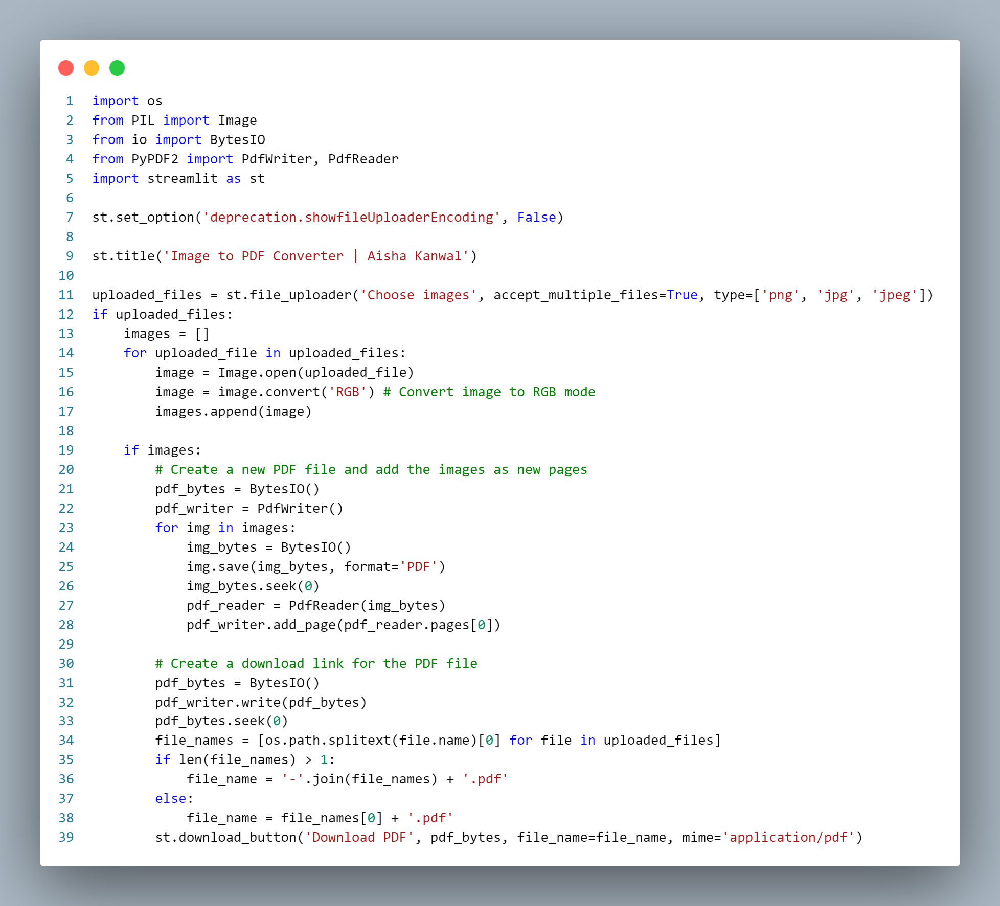
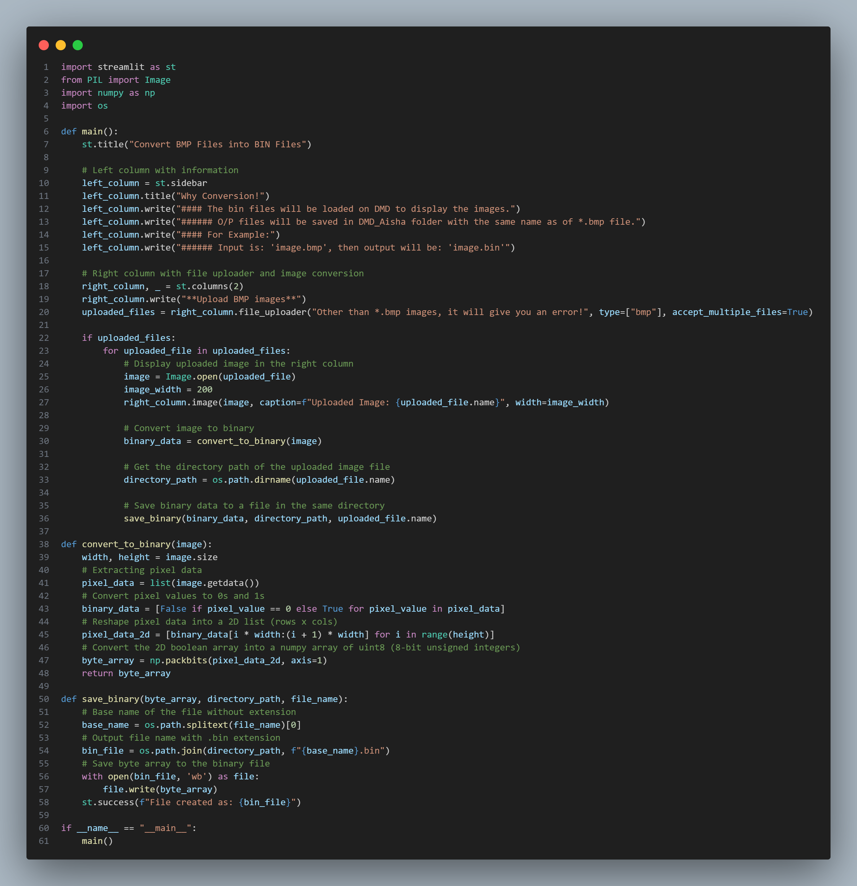

# Streamlit-Work
Codes are available here for making dashboards using streamlit library in Python

1. here is a codesnap of the code that convert one or more images into a pdf file.

2. here is a codesnap for the script that convert *.bmp images into *.bin file.

